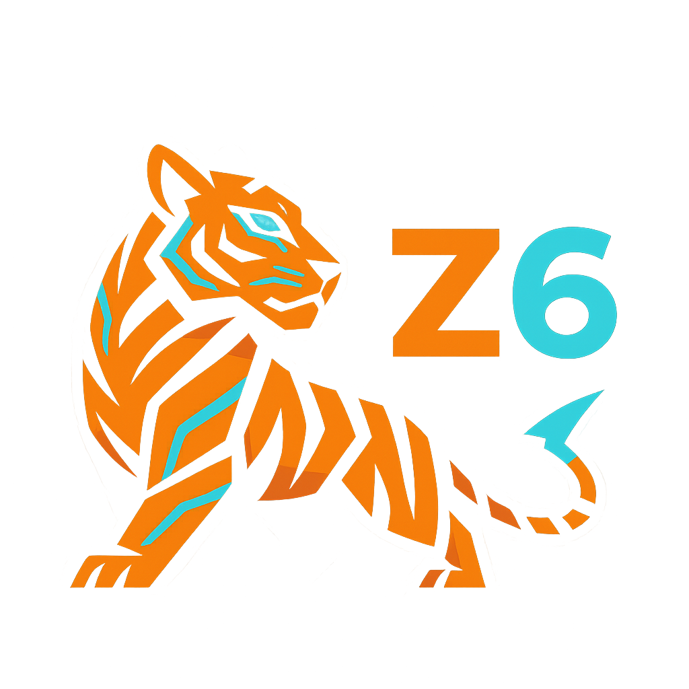

<div align="center">



# Z6 — Deterministic Load Testing

[](https://github.com/copyleftdev/z6)
[](https://github.com/copyleftdev/z6)
[](LICENSE)
[](https://ziglang.org)
[](docs/MANIFESTO.md)

> "Precision over flexibility. Correctness before performance. Auditability always."

[Documentation](docs/) • [Roadmap](ROADMAP.md) • [Contributing](docs/CONTRIBUTING.md)

</div>

---

Z6 is a load testing tool built with **Tiger Style** philosophy—inspired by TigerBeetle's discipline of determinism, bounded complexity, and zero technical debt.

## Philosophy

Unlike K6, Locust, or other convenience-focused tools, Z6 prioritizes:

1. **Deterministic Reproducibility** — Every test is bit-for-bit reproducible with the same seed
2. **Auditability** — Complete event log captures every action for post-run analysis
3. **Bounded Complexity** — All resources explicitly limited, no unbounded growth
4. **Zero Technical Debt** — Do it right the first time, test before implement

**No scripting. No garbage collection. No surprises.**

## Status

**⚠️ Pre-Alpha — Documentation Phase Complete**

Z6 is currently in the documentation phase. All 20 technical specifications are complete. Implementation begins with Phase 0 of the roadmap.

## Quick Links

### Documentation (Complete)
- **[MANIFESTO.md](docs/MANIFESTO.md)** — Core philosophy and principles
- **[ARCHITECTURE.md](docs/ARCHITECTURE.md)** — System design
- **[HTTP_PROTOCOL.md](docs/HTTP_PROTOCOL.md)** — HTTP/1.1 & HTTP/2 implementation
- **[All Docs](docs/)** — 20 complete technical specifications

### Development
- **[ROADMAP.md](ROADMAP.md)** — 32 tasks across 7 phases (~710 hours)
- **[ROADMAP_USAGE.md](ROADMAP_USAGE.md)** — How to use the roadmap
- **[CONTRIBUTING.md](docs/CONTRIBUTING.md)** — Tiger Style contribution guide

### Workflows
- **[Branch Protection](.github/BRANCH_PROTECTION.md)** — No CI/CD, pre-commit hooks only
- **[PR Template](.github/PULL_REQUEST_TEMPLATE.md)** — Required sections for PRs

## Features (Planned)

### v1.0 (HTTP Only)

- ✅ **Deterministic execution** with seeded PRNG
- ✅ **HTTP/1.1 & HTTP/2** support with TLS
- ✅ **Declarative scenarios** in TOML (no scripting)
- ✅ **Event-driven architecture** with immutable event log
- ✅ **Post-run metrics** computed from events
- ✅ **Bit-for-bit replay** verification
- ✅ **Bounded resources** (100K VUs, 10M events, 16GB RAM)
- ✅ **HDR Histogram** for accurate latency percentiles
- ✅ **Fuzzing** for all parsers (1M+ inputs)

### Future

- gRPC support (v1.1+)
- WebSocket support (v1.2+)
- Distributed execution (v2.0+)

## Example

```toml
# scenario.toml
[metadata]
name = "API Load Test"

[runtime]
duration_seconds = 60
vus = 100
prng_seed = 42  # Deterministic

[target]
base_url = "https://api.example.com"
http_version = "http2"

[[requests]]
name = "create_user"
method = "POST"
path = "/api/v1/users"
headers = { "Content-Type" = "application/json" }
body = '''{"name": "Test", "email": "test@example.com"}'''
weight = 0.3

[[requests]]
name = "get_user"
method = "GET"
path = "/api/v1/users/123"
weight = 0.7

[assertions]
p99_latency_ms = 100
error_rate_max = 0.01
```

Run:

```bash
z6 run scenario.toml --seed 42

# Output:
# Z6 Load Test Results
# ====================
# Duration: 60.0s
# Virtual Users: 100
#
# Requests: 120,000
# Success: 119,500 (99.6%)
#
# Latency (ms):
#   p50: 38.5
#   p99: 142.7
#
# Assertions:
#   ✓ p99 latency under 100ms
#   ✓ error rate under 1%
```

Replay (deterministic verification):

```bash
z6 replay results/events.log --verify
# ✓ Replay successful, events match exactly
```

## Development Setup

### Prerequisites

- Zig 0.11.0+
- Linux or macOS (Windows TBD)
- 16 GB RAM recommended

### Install Pre-Commit Hook

**REQUIRED before any development:**

```bash
./scripts/install-hooks.sh
```

The hook enforces Tiger Style:
- Code formatting (`zig fmt`)
- Assertion density (min 2 per function)
- Bounded loops
- Build success
- All tests pass

### Start Development

```bash
# 1. Install hook (mandatory)
./scripts/install-hooks.sh

# 2. Create GitHub issues from roadmap
python3 scripts/generate-issues.py --dry-run   # Preview
python3 scripts/generate-issues.py --create    # Create all issues

# 3. Pick a task from Phase 0 (Foundation)
# See ROADMAP.md

# 4. Create branch
git checkout -b feat/TASK-001

# 5. Write tests FIRST
# (Test-driven development)

# 6. Implement code
# (Follow acceptance criteria)

# 7. Commit (hook runs automatically)
git add .
git commit -m "feat: implement feature (#001)"

# 8. Push and create PR
git push origin feat/TASK-001
```

## Architecture

```
┌─────────────────────────────────────────────────────────────┐
│                         Z6 Runtime                          │
│                                                             │
│  ┌──────────────┐      ┌─────────────────┐                │
│  │   CLI        │─────▶│  Scenario       │                │
│  │   Parser     │      │  Loader         │                │
│  └──────────────┘      └────────┬────────┘                │
│                                 │                          │
│                                 ▼                          │
│                        ┌─────────────────┐                │
│                        │   Scheduler     │                │
│                        │  (Microkernel)  │                │
│                        └────────┬────────┘                │
│                                 │                          │
│                    ┌────────────┼────────────┐            │
│                    │            │            │            │
│                    ▼            ▼            ▼            │
│            ┌──────────┐  ┌──────────┐  ┌──────────┐      │
│            │  VU #1   │  │  VU #2   │  │  VU #N   │      │
│            │  Pool    │  │  Pool    │  │  Pool    │      │
│            └────┬─────┘  └────┬─────┘  └────┬─────┘      │
│                 │             │             │            │
│                 └─────────────┼─────────────┘            │
│                               │                          │
│                               ▼                          │
│                      ┌─────────────────┐                │
│                      │  Protocol       │                │
│                      │  Engine Layer   │                │
│                      └────────┬────────┘                │
│                               │                          │
│                               ▼                          │
│                     ┌─────────────────┐                │
│                     │  Event Logger   │                │
│                     └────────┬────────┘                │
│                              │                          │
│                              ▼                          │
│                     ┌─────────────────┐                │
│                     │  Event Log      │                │
│                     │  (Immutable)    │                │
│                     └─────────────────┘                │
│                                                           │
└─────────────────────────────────────────────────────────────┘
```

**Key Principles:**
- **Single-threaded** — Deterministic by design
- **Logical ticks** — Not wall-clock time
- **Event-driven** — Everything is an event
- **Immutable log** — Source of truth for metrics

## Tiger Style Development

### Test Before Implement

```bash
# 1. Write failing test
zig build test  # FAILS

# 2. Implement minimum code
# Add assertions (min 2 per function)

# 3. Test passes
zig build test  # PASSES
```

### Pre-Commit Hook

Every commit is validated:

```
🐅 Tiger Style Pre-Commit Hook
==============================

→ Checking code formatting...
✓ Code formatted correctly

→ Checking assertion density...
✓ Assertion density satisfied

→ Checking for unbounded loops...
✓ All loops bounded or explicitly marked

→ Checking for explicit error handling...
✓ No silent error handling

→ Building project...
✓ Build successful

→ Running unit tests...
✓ All unit tests passed

==============================
✓ All checks passed

🐅 Tiger Style approved
```

### No CI/CD Builds

Z6 does **NOT** use GitHub Actions for builds or tests.

**Why?**
- Slow feedback loop (wait for CI)
- "Push and pray" culture
- Resource waste
- Developers should know code works

**Instead:**
- Pre-commit hook runs locally
- Immediate feedback
- Developer ownership
- Quality enforced, not suggested

See [.github/BRANCH_PROTECTION.md](.github/BRANCH_PROTECTION.md) for details.

## Comparison

| Feature | K6 | Locust | Z6 |
|---------|-----|--------|-----|
| Language | JavaScript | Python | Zig |
| Determinism | ❌ | ❌ | ✅ |
| Event Log | ❌ | ❌ | ✅ |
| Replay | ❌ | ❌ | ✅ |
| Scripting | ✅ | ✅ | ❌ (declarative) |
| GC | ✅ | ✅ | ❌ |
| Bounded Resources | ❌ | ❌ | ✅ |
| Fuzzing | ❌ | ❌ | ✅ |

Z6 trades flexibility for **guarantees**.

## Roadmap

**Phase 0: Foundation** (3 tasks, ~26 hours)
- Repository structure
- Pre-commit hooks
- Build system

**Phase 1: Core** (3 tasks, ~76 hours)
- Event model
- Memory model
- Scheduler

**Phase 2: HTTP** (5 tasks, ~176 hours)
- Protocol interface
- HTTP/1.1 parser & handler
- HTTP/2 parser & handler

**Phase 3: Execution** (3 tasks, ~84 hours)
- Scenario parser
- VU engine
- CLI

**Phase 4: Metrics** (3 tasks, ~68 hours)
- HDR histogram
- Metrics reducer
- Output formatters

**Phase 5: Testing** (3 tasks, ~96 hours)
- Fuzz infrastructure
- Integration tests
- Property-based tests

**Phase 6: Polish** (3 tasks, ~56 hours)
- Documentation
- Limits validation
- Performance benchmarking

**Phase 7: Release** (1 task, ~40 hours)
- Final verification
- v1.0.0 release

**Total: 32 tasks, ~710 hours**

See [ROADMAP.md](ROADMAP.md) for complete details.

## Contributing

Read [docs/CONTRIBUTING.md](docs/CONTRIBUTING.md) for detailed guidelines.

**Quick summary:**
1. Install pre-commit hook
2. Pick task from roadmap
3. Write tests FIRST
4. Implement with Tiger Style
5. All checks must pass
6. Create PR with complete description
7. Code review
8. Squash merge

**Tiger Style Requirements:**
- Minimum 2 assertions per function
- All loops bounded
- Explicit error handling
- No technical debt
- >90% test coverage

## License

TBD (MIT or Apache 2.0)

## Contact

- **GitHub Issues** — Bug reports, feature requests
- **GitHub Discussions** — Questions, ideas

## Acknowledgments

- **TigerBeetle** — Inspiration for Tiger Style philosophy
- **K6** — Demonstrated need for better load testing tools

---

**🐅 Tiger Style: Do it right the first time.**

**Version 1.0 — October 2025**
